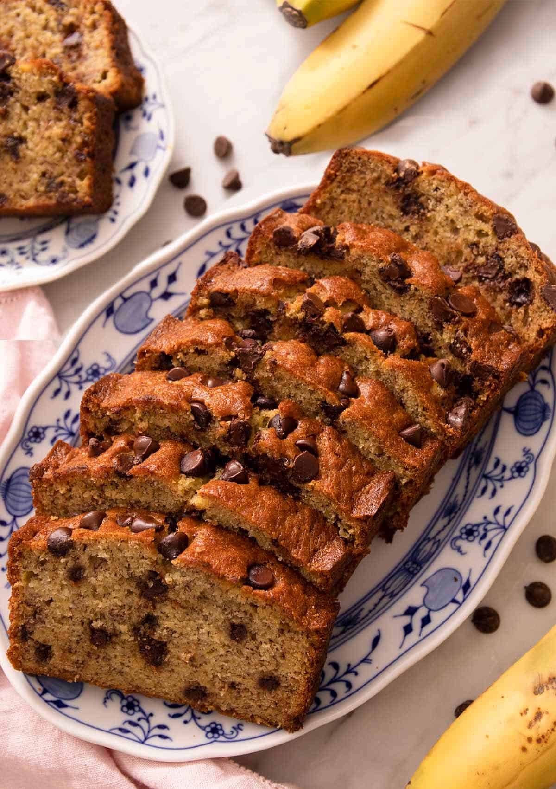

# Banana Bread - A Healthier Take 

## Ingredients

Here's what you'll need:

 

- **Oat Flour:** It's just oats blended into a flour-like consistency. Don't worry if you don't have a blender; you can find oat flour in most grocery stores or order it online.

- **Eggs:** These are our binding agents, ensuring your bread is fluffy and delightful.

- **Sugar:** Choose your preferred type - brown, white, coconut sugar etc.

- **Butter:** Melted!

- **Cinnamon:** Because who can resist that cozy cinnamon kick in banana bread?

- **Sea Salt:** Just a pinch to enhance all the flavors.

- **Baking Soda:** The magic ingredient that helps it rise.

- **Chocolate Chips:** Optional but highly recommended. Sprinkle some in the batter and on top for that extra indulgence.

 

---
 

### More specifically, you'll need:
 

- 3 ripe bananas

- 2 eggs

- 1 tsp of vanilla extract

- 2 cups of oat flour (you can make this using the oats or buy it)

- 1/2 cup of coconut sugar

- 2 tbp of butter (melted)

- 1/4 tsp of sea salt

- 1 tsp of baking soda

- 1 tsp of ground cinnamon

- Chocolate chips to mix into the batter and sprinkle on top

 

---
 

## Instructions
 

1. Preheat your oven to 180°C (360°F) and grease a loaf pan. If you want extra insurance against sticking, add parchment paper.

2. Mash the bananas with a fork in a mixing bowl. Then, add the egg, vanilla, sugar, and cinnamon. Stir everything well until it's thoroughly combined.

3. In a separate small bowl, mix together the flour, baking powder, baking soda, and salt. Once mixed, add this dry mixture to the wet mixture in the mixing bowl. Carefully fold the two mixtures together.

4. Gently stir in the melted butter.

5. Bake in the preheated oven at 180°C (360°F) for 35-45 minutes or until a toothpick inserted into the center comes out clean.

6. Allow the banana bread to cool in the pan for 5-10 minutes before inverting it onto a wire cooling rack.

Enjoy your delicious and healthy banana bread!

 

