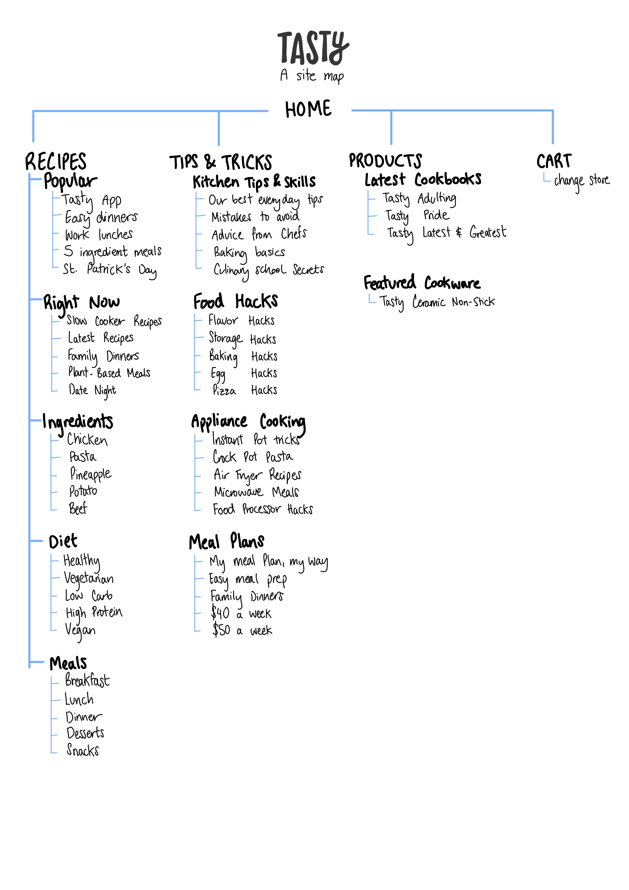

# Part 1 - Site Map

 
 

# Part 2 - Wire Framing

### UX design requires effective communication and collaboration with different teams.
### Wireframing is a vital tool for generating ideas in UX design.
So it's important to deliberate over details before diving into screen design.
### Considerations for wireframing:
* Clarify the problem by asking key questions - purpose of project, how the problem is identified, target audience, and where the design will be implemented.
* Collaborative sketching helps identify interactions and workflows.
* Seek early feedback for technical insights and timelines - aids in scoping out development timeframes
* Wireframing tools for efficiency - keyboard shortcuts, templates, do what you can to save time
* Tailor fidelity of wireframes to the audience's level of understanding.

#### Focus on wireframing solutions aligned with the project's goals and target audience.
 
 

# Part 3 & 4 - Layout of Recipe Page

 

## Some CSS 
header{
	color: #FFF;
	font-family: Inter;
	font-size: 30px;
	font-style: normal;
	font-weight: 700;
	line-height: normal;
}

h1{
	color: #FFF;
	font-family: Inter;
	font-size: 60px;
	font-style: normal;
	font-weight: 700;
	line-height: normal;
}

h2{
	color: #FFF;
	font-family: Inter;
	font-size: 40px;
	font-style: normal;
	font-weight: 700;
	line-height: normal;
}

article{
	width: 521px;
	height: 692px;
	flex-shrink: 0;
	border-radius: 105px;
	background: #FFFCFC;
}

nav{
	color: #FFF;
	font-family: Inter;
	font-size: 30px;
	font-style: normal;
	font-weight: 400;
	line-height: normal;
}